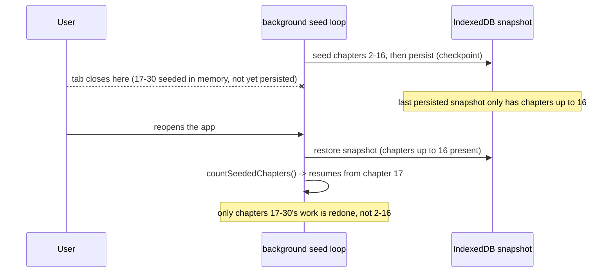
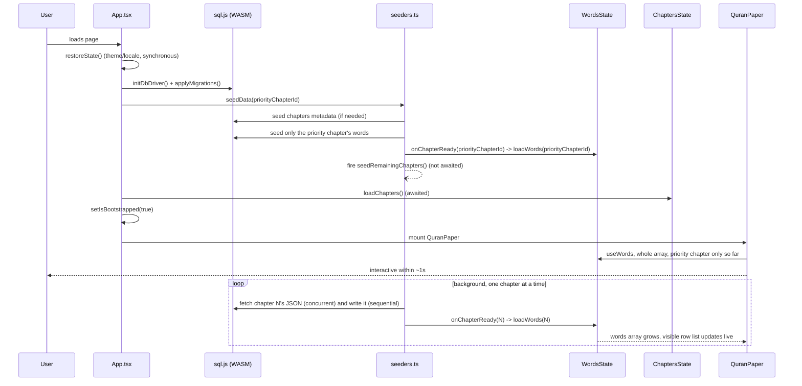
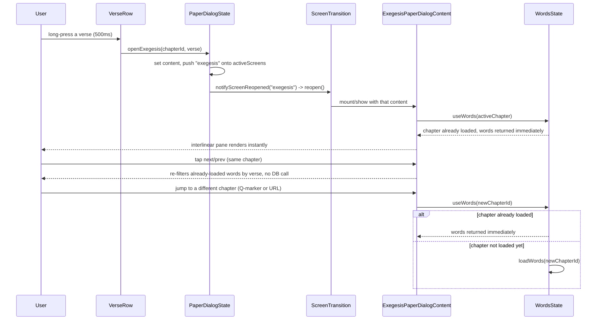
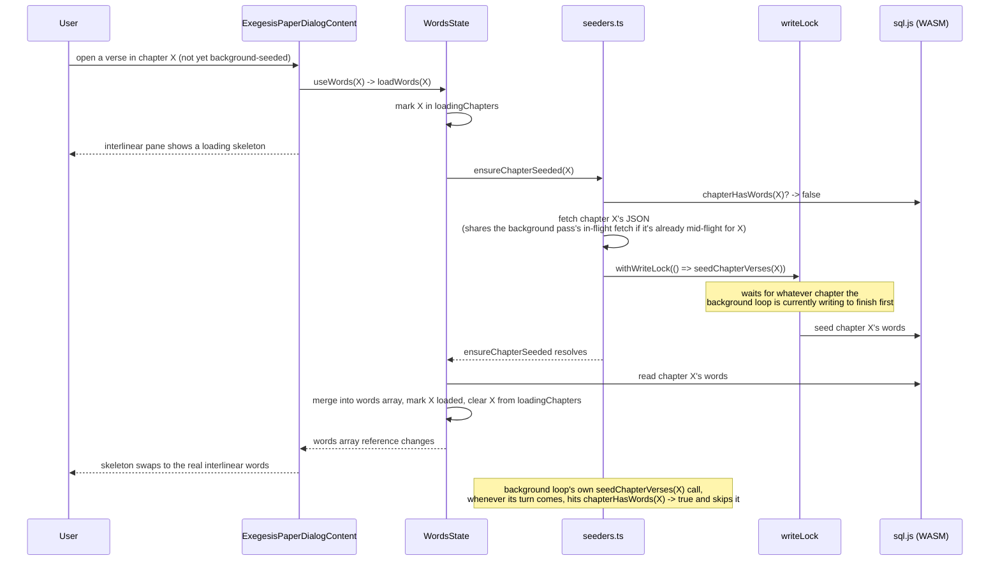

# bil-quran

Bil-Quran is an Qur'an app where translation is provided interlinear (or word-by-word/verse-by-verse) to aid with understanding the Qur'an for those who want to read the Qur'an not just at the Qira'ah/recitation level.

This project was bootstrapped with [Create React App](https://github.com/facebook/create-react-app).

- `pnpm start`: Starts the development server.
- `pnpm run build`: Bundles the app into static files for production.
- `pnpm test`: Starts the test runner.
- `pnpm run deploy`: Cause `predeploy` and `deploy` script to run.

  Under the hood, the `predeploy` script will build a distributable version of the React app and store it in a folder named `build`. Then, the deploy script will push the contents of that folder to a new commit on the `gh-pages` branch of the GitHub repository, creating that branch if it doesn't already exist.

  Then, the app will be visible at: [systatum.github.io/bil-quran](https://systatum.github.io/bil-quran/)

App unique features:

- Allow you to learn word-by-word
- Allow you to see tajwid rules and words in the quran exemplify those rules
- Respect both Sunni and Shi'i perspective of what makes Surat Sajdah

## If I had more time

- Ability to bookmark any verse and go to that any moment
- Can lookup by: root word, and verse theme.
- Normalize such as in baqarah 10: اَلِیْمٌۢ بِمَا the mim at the first word has indicator of mim
- Make it easy to learn tajwid on the app
- Add a feature to report an issue
- Rate translation feature (this needs Ligo backend).
- Ability to find by text: type in the text of the ayah, in Arabic or English, no matter how bad/wrong or how partially correct, can still give estimate
- Add "copy link" on verse marker and on exegesis dialog, to copy link to respective path
- Auto add \_\_\_ on words like SAW SWT RA with tooltip displaying localized meaning.
  -Add site / guess tracker google web service style

## Stack

- React via create-react-app (webpack stack)
- TanStack router for navigation, instead of react-router-dom, as it's strongly typed

## Test to be made

- [ ] Test when user translations has English and Indonesian, both are shown fine on first load (Indonesian is not the default). This is to test first pre-flight translation downloading and insertion works.
- [ ] Try raising error at the translator-level (ie at the i18n's formatMessage) and ensure that we see an error screen; otherwise we miss a locale, and the user is not seeing any error. Another simple way is inject into `WordTranslationOption` some fake value, where there's no corresponding i18n key for that in locale files, and so the lookup will generate a null/undefined, causing error on formatMessage-part automatically.
- [ ] If we add another locale, and then refresh the page, we should not redownload the locale (this proves that database persisting works for all new-locale)
- [ ] Add madhab mode (shia/sunni)
- [ ] Check overlay behavior: if sidebar is opened, has overlay, and clicking overlay close the sidebar. Same expected behavior with search bar.
- [ ] Fix 2:204 word 16 buggy cannot scroll down
- [ ] Test bookmark can click and go to that verse.
- [ ] When having bookmark data, ensure that scrollbar is shown and user can scroll when there are a lot of bookmark.

ءَا
لْإِ
"\w+/
sedikit/([\w\-\s]+")

standardize مَنْ in indonesian (like 2:200) so that it reads "barang siapa" (or "yang" better?) rather than "orang" (but must check the English, if it is just whom or who -> yang, if it is (to) whom then (ke) yang, (is he) -> (ialah) yang; other than that put te english word as-is: (english) yang)

good ayat to check: 2:200, 3:26,

dalam dalam -> dalam
adalah ia -> ia

## Architecture

No backend server. Everything runs client-side (browser or, for the mobile
build, a WebView), backed by static files under `public/`.

- **Bootstrap** (`src/App.tsx`): registers fonts, then in order inits
  `sql.js` (WASM SQLite), runs Drizzle migrations
  (`public/table_migrations/`), seeds data, and loads chapters/settings.
- **Data**: Qur'an data (chapters, verses, word-by-word, tafsir) lives as
  JSON under `public/quran/`, split by `scripts/split-chapter.js`. Seeding
  (`src/db/seeders.ts`) only runs against empty tables, so it's a no-op on
  repeat launches.
- **Asset paths**: built from `window.location.origin` at runtime
  (`src/constants/assets.ts`), not a hardcoded domain, so the same code
  works on `bil-quran.com`, `localhost`, or `capacitor://localhost`.
- **Offline**: `public/quran/fingerprints.json` (MD5 manifest,
  `scripts/fingerprinter.js`) lets `src/services/fingerprinter.ts` detect
  when the IndexedDB-persisted SQLite snapshot is stale and needs
  re-seeding. If the manifest can't be fetched, the existing local DB is
  trusted as-is. There is no service worker.
- **Fonts**: bundled locally under `public/fonts/`, no external font CDN.

### Database seeding

`sql.js` runs SQLite compiled to WASM synchronously on the main thread, with no worker to hand queries off to. Every insert, select, and export blocks input and paint for exactly as long as it takes to execute, so the seeding layer can't rely on the browser staying responsive on its own. It has to give control back explicitly, and it has to bound how much work stands between page load and the user actually being able to do something.

Giving control back is a matter of chunking. Building the roots/lexemes dedup maps and batch-inserting rows both loop over thousands of items, and both yield partway through with a plain `setTimeout`:

```ts
for (let i = 0; i < items.length; i++) {
  process(items[i])
  if (i % YIELD_EVERY === 0) await pause(0)
}
```

`pause(0)` is `setTimeout(resolve, 0)`. That matters specifically because `setTimeout` schedules a macrotask, so the browser genuinely gets a turn to paint and handle input before the loop resumes; a microtask like `Promise.resolve()` would not yield to rendering at all. This alone doesn't shrink the total amount of seeding work, it just stops any single pass from running long enough for the browser to be considered frozen.

Bounding the work is a separate move, and a more structural one: instead of seeding all 114 chapters before the app can be touched, `App.tsx` picks one priority chapter, whichever the deep link points to, else the last-viewed chapter, else chapter 1, seeds only that, and flips the app into its interactive state immediately after. The remaining 113 chapters seed afterward as a background pass, each one calling back into `WordsState` so `QuranPaper`'s row list grows live as chapters land, with no reload needed to see them appear.

That background pass is also where seeding and rendering actually interleave, and it's worth seeing why one doesn't starve the other:

```ts
async function seedRemainingChapters(chapters, onChapterReady) {
  for (const chapter of chapters) {
    await seedChapterVerses(chapter)   // DB writes, chunked and yielding internally
    onChapterReady(chapter.id)         // merges into WordsState, schedules a React re-render
    await pause(0)                     // hands control back before touching the next chapter
  }
}
```

`onChapterReady` runs synchronously: it updates the store, which schedules a re-render, but doesn't force React to actually paint it right there. That's what `pause(0)` is for. Without it, this loop would run chapter after chapter with nothing in between, and the DOM wouldn't change until the whole loop finally stopped, no matter how many chapters had already been merged into the store. With it, every chapter gets its own turn on the event loop: seed it, notify the store, yield, and only then move on, so the scheduled re-render, a pending scroll, a tap, or anything else queued up actually gets to run before the next chapter's work begins. Seeding one chapter and rendering the result of the previous one end up taking turns on the same thread instead of one blocking the other.

That background pass fetches every remaining chapter's JSON concurrently, since that's plain network I/O touching no shared state, but writes each chapter to the database one at a time. The sequencing is load-bearing, not incidental: roots and lexemes are populated with a check-then-insert pattern, look up which tokens already exist, then insert whatever's missing, and that pattern is only correct if one chapter's write finishes before the next one starts:

```ts
const existing = await findExisting(tokens)
const missing = tokens.filter((t) => !existing.has(t))
await insertMissing(missing)
```

Run this for two chapters at once and both can miss the same not-yet-inserted token in their `findExisting` lookup and then both insert it, corrupting the dedup. Sequential writes make that impossible by construction, and a UNIQUE constraint on `roots.root` and `lexemes.token` backs it up as a database-level guarantee, so if a future change ever breaks the sequencing, the insert fails loudly instead of silently duplicating rows.

```mermaid
sequenceDiagram
    participant C5 as Chapter 5 seed
    participant C6 as Chapter 6 seed
    participant DB as roots table

    rect rgb(255, 230, 230)
    Note over C5,C6: hypothetical, if these ran concurrently
    C5->>DB: findExisting("حمد") -> not found
    C6->>DB: findExisting("حمد") -> not found (C5 hasn't inserted yet)
    C5->>DB: insert "حمد"
    C6->>DB: insert "حمد"
    DB--xC6: UNIQUE constraint violation
    end

    rect rgb(230, 255, 230)
    Note over C5,C6: what actually happens, strictly sequential
    C5->>DB: findExisting("حمد") -> not found
    C5->>DB: insert "حمد"
    Note over C5: chapter 5 fully done before chapter 6 starts
    C6->>DB: findExisting("حمد") -> found
    C6->>DB: skip, already exists
    end
```



The background pass also persists to IndexedDB every 15 chapters, so if the tab closes mid-seed, the next load resumes from that checkpoint instead of redoing everything from scratch:



The background pass isn't the only caller that writes a chapter's words: opening the exegesis dialog on a chapter the background pass hasn't reached yet seeds that chapter immediately rather than waiting (see Request flows below). Both paths have to honor the same sequential-writes requirement, so what actually enforces it is a single module-level promise, not a queue:

```ts
let writeLock: Promise<unknown> = Promise.resolve()

function withWriteLock<T>(fn: () => Promise<T>): Promise<T> {
  const result = writeLock.then(fn, fn)
  writeLock = result.catch(() => {}) // never leave the chain rejected
  return result
}
```

Every chapter write, background or on-demand, goes through `withWriteLock`. Each call chains onto whatever the previous call left in `writeLock` and becomes the new value of `writeLock` itself, so calls pile up strictly one after another no matter which caller reaches it first or how many arrive at once. There's no priority to compute and nothing to track beyond this one reference, because the requirement was never "on-demand goes first," it was just "writes never overlap."

`ensureChapterSeeded(chapterId)` is the on-demand entry point this backs: check `chapterHasWords`, and if it's genuinely missing, fetch its JSON and write it through `withWriteLock`. The fetch goes through the same in-flight-promise cache `FingerprintedAsset.readJson` already uses, so if the background pass's own concurrent prefetch is mid-flight for that exact chapter, this call reuses that same promise instead of firing a second request for it.

Measured on a real cold start, this brought time-to-interactive down from roughly 3.7 seconds to under one second, with the full background pass across all 114 chapters finishing in about 20 seconds without ever blocking user interaction.

### Rendering

`QuranPaper` renders the Qur'an as one continuous scrollable list, but the DOM never holds more than the currently visible rows plus a small overscan buffer. `@tanstack/react-virtual`'s `useVirtualizer` decides which slice of the row list is on screen, using each row's real measured height rather than a fixed estimate, since word-by-word interlinear text wraps differently verse to verse; each `VerseRow` measures itself after paint and reports the result into a shared size map the virtualizer reads from.

Getting from database rows to that row list is a short, ordered pipeline. `useWords` reads whatever words `WordsState` currently holds, either the whole app's worth or a single chapter's, depending on the caller. `useTranslatedWords` attaches each word's meaning in the selected locale, or locales, from `TranslationsState`'s compiled corpora. `useGroupedVerses` folds that flat word list into `Verse` objects keyed by chapter and verse number. `QuranPaper` then walks those verses once more, inserting a chapter-header row wherever the chapter changes, and hands the resulting flat list to the virtualizer.

The detail that shapes everything downstream of it: `words` is not a fixed snapshot taken once. It's backed by a store that keeps growing for as long as the background seed described above is running, so this pipeline is really re-running continuously against a data source that's still incomplete. Every function in it has to be correct not just for "the final state" but for "called again, moments later, with a slightly bigger input." One implication is performance: recomputing over the full array on every growth increment gets more expensive as it grows, so `useTranslatedWords` and `useGroupedVerses` both detect an append (new length, same first element) and only process what's new rather than starting over. Another is a real gotcha this pipeline ran into: `VerseRow` calls the corpus loader independently per row rather than through one shared call, which is fine when the loader is idempotent, except its check-then-fetch wasn't atomic, so on first render 30 to 40 rows would each see the corpus unloaded and each redundantly compile the same ~77,000-row corpus at once. Fixed with an in-flight-promise cache, confirmed via Chrome's Long Tasks API to remove a 2.5 to 2.9 second block that used to show up on nearly every cold start.

A third implication is architectural rather than a performance number: since `words` can legitimately be incomplete for a chapter that hasn't seeded yet, nothing downstream can distinguish "this chapter has no words" from "this chapter just hasn't arrived yet" without checking seeding state directly. Jumping to an unseeded chapter, covered in Request flows below, is the sharpest case of that.

### Request flows

These sketch the current, as-built behavior end to end, across the database, the seeding layer, and the UI.

**Opening the app.** The priority chapter (from the deep link, else the last-viewed chapter, else chapter 1) is the only thing seeded before the app is usable. Everything else happens after, in the background.



**Opening the exegesis dialog and moving between verses.** The dialog only depends on its own chapter's words, so once that chapter is loaded, moving between verses in it is free.



**Jumping to a verse whose chapter hasn't been seeded yet.** A Q-marker link, a deep link, or a lookup can point at a chapter the background pass hasn't reached. Rather than waiting for the ordinary background order to get there, that chapter is seeded on demand, and the dialog shows a loading skeleton while it does.



## Mobile

The project can also built as a native Android application using Capacitor.

Asset paths resolve against `window.location.origin`, and
`webDir: "build"` packages all of `public/quran/` and `public/fonts/` into
the APK. So the app needs no network connection after install: reading
Qur'an/tafsir data is a local read off the bundled assets, not a download.

### Requirements

- **JDK 21**, required by `@capacitor/android`'s own Gradle module no
  matter what JDK the rest of the project uses. If your default
  `JAVA_HOME` is older, point Gradle at Android Studio's bundled JBR
  instead of installing a separate JDK:
  ```bash
  JAVA_HOME="/Applications/Android Studio.app/Contents/jbr/Contents/Home" \
    ./gradlew assembleDebug
  ```
- **Android SDK Platform 36 and Build-Tools 36**, matching
  `compileSdk`/`targetSdk` in `android/variables.gradle`.

  We can check by:

  ```
  grep -R "compileSdk\|targetSdk\|minSdk" android/gradle* android/build.gradle android/variables.gradle 2>/dev/null
  ```

  Then install via Android Studio's SDK Manager (SDK Platforms and SDK Tools tabs), or
  `sdkmanager "platforms;android-36" "build-tools;36.0.0"`.

- **A device or emulator** on any API level at or above `minSdkVersion`
  (24). `compileSdk`/`targetSdk` only affect what the app is built
  against, not what it can run on, so the emulator doesn't need to match
  API 36.
- Android Studio itself isn't required if you're targeting a physical
  device over USB. It's mainly useful here for its bundled JBR and its
  emulator/AVD manager.

### Running on an Android Device

There are two ways to run the application on a physical Android device.

#### Option 1: Live Development (Recommended)

To use the React development server with live reload, configure the Capacitor `server` option:

```ts
import { CapacitorConfig } from "@capacitor/cli"

const config: CapacitorConfig = {
  appId: "com.systatum.bilquran",
  appName: "BilQuran",
  webDir: "build",
  server: {
    url: "http://<YOUR_LOCAL_IP>:3000",
    cleartext: true,
  },
}

export default config
```

Replace `<YOUR_LOCAL_IP>` with the local IP address of your development machine (for example `192.168.1.10`).

Then:

1. Connect your computer and Android device to the same Wi-Fi network.
2. Start the React development server:

   ```bash
   pnpm start
   ```

3. Launch the Android application:

   ```bash
   pnpm start:android
   ```

Changes made to the React application will be served from the local development server, making development much faster.

#### Option 2: Without a Development Server

If you do not configure the `server` option, Capacitor will load the bundled web assets from the `build` directory instead of your local development server.

Before running the application, build and synchronize the latest assets:

```bash
pnpm build:mobile:android
```

Then launch the application:

```bash
pnpm start:android
```

> **Note:** In this mode, changes to the React application are **not** reflected automatically. You must rebuild (`pnpm build:mobile:android`) each time you modify the web application before running it again.

> **Note:** The `server` configuration is intended for development only. Remove the `server` section before creating production builds (`APK` or `AAB`) so the application loads the bundled files from the `build` directory.

### Running on an Android Emulator

No physical device? An emulator works the same way, and you don't need to
touch the `server` config for it.

1. Create an AVD in Android Studio (Device Manager, if you don't have one
   yet), or boot an existing one:

   ```bash
   ~/Library/Android/sdk/emulator/emulator -avd <YOUR_AVD_NAME>
   ```

   Leave this running in its own terminal. You can list your AVDs with
   `~/Library/Android/sdk/emulator/emulator -list-avds`.

2. Once it's fully booted, build and launch the app on it:

   ```bash
   pnpm build:mobile:android
   pnpm start:android
   ```

   `start:android` runs `cap run android`, which detects the running
   emulator and installs the app on it automatically.

The emulator's Android version doesn't need to match `compileSdk`/`targetSdk`
(see [Requirements](#requirements)), so any AVD at or above API 24 works.

### Sync Web Assets

Build the React application and synchronize it with the Android project:

```bash
pnpm build:mobile:android
```

This command will:

1. Build the React application.
2. Generate the production files.
3. Synchronize the latest web assets into the Capacitor Android project.

### Generate Android APK

To build a release APK:

```bash
pnpm build:android:apk
```

This command will:

1. Run `build:mobile:android`.
2. Build a signed Android APK using Gradle (`assembleRelease`).

The generated APK can be found at:

```text
android/app/build/outputs/apk/release/app-release.apk
```

### Generate Android App Bundle (AAB)

To build an Android App Bundle for Google Play:

```bash
pnpm build:android:aab
```

This command will:

1. Run `build:mobile:android`.
2. Build a release App Bundle using Gradle (`bundleRelease`).

The generated AAB can be found at:

```text
android/app/build/outputs/bundle/release/app-release.aab
```

### Available Commands

| Command                     | Description                                                                  |
| --------------------------- | ---------------------------------------------------------------------------- |
| `pnpm start:android`        | Run the application on an Android device using the local development server. |
| `pnpm build:mobile:android` | Build the web app and sync it to the Android project.                        |
| `pnpm build:android:apk`    | Build a release Android APK.                                                 |
| `pnpm build:android:aab`    | Build a release Android App Bundle (AAB).                                    |

### Platform-specific Styling

When using Capacitor, you can detect the current platform and apply different styles or behavior for Android and iOS.

```ts
import { Capacitor } from "@capacitor/core"

const platform = Capacitor.getPlatform()

console.log(platform) // "ios", "android", or "web"
```

#### Example: Using `styled-components`

You can use the detected platform to conditionally apply styles.

```tsx
import { Capacitor } from "@capacitor/core"
import styled from "styled-components"

const isIOS = Capacitor.getPlatform() === "ios"

const Container = styled.div<{ $isIOS: boolean }>`
  padding-top: ${({ $isIOS }) => ($isIOS ? "44px" : "24px")};
`

function App() {
  return <Container $isIOS={isIOS}>Content</Container>
}
```

This approach is useful when you need different spacing, safe area handling, or platform-specific UI adjustments between Android and iOS.
